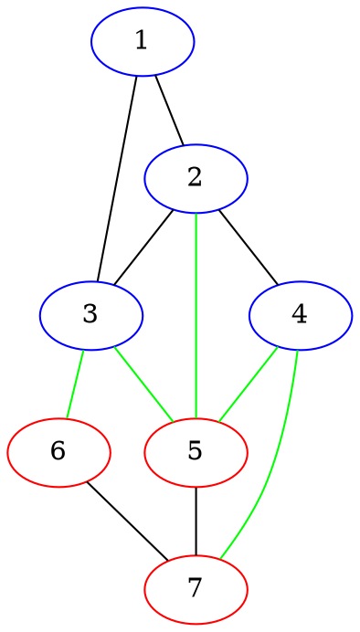
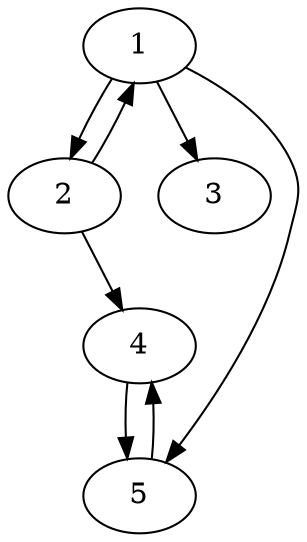
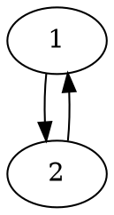
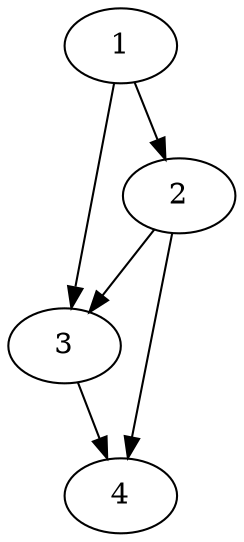
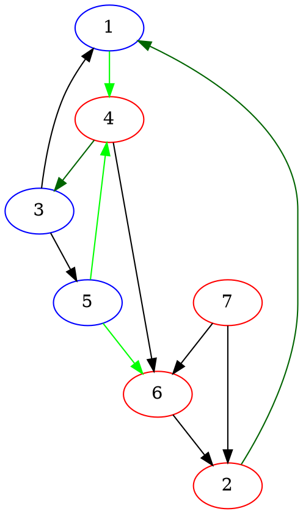
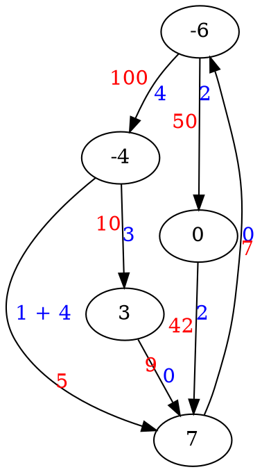
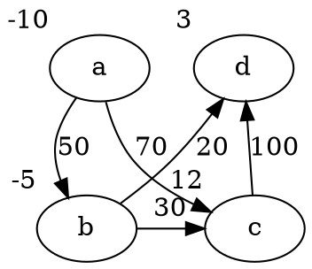

# CO 351 - Network Flow Theory

## Lecture September 08, 2017

### Graph Theory

A **graph** $G$ is a pair $(V, E)$ of vertices $V$, and _unordered_ pairs of $V$ called **edges** in $E$.  
**Degree of a vertex** $v$ is the number of edges incident with it, $d_{G}(v)$ or $d(v)$.

A **walk** is a sequence $v_{0}, v_{1}, ..., v_{k}$ where $v_{i}v_{i+1}$ are edges.  
A **path** is a walk with no repeated vertices or edges.

A graph is **connected** if there is a path between any 2 vertices.

A **cycle** is a sequence $v_{0}, v_{1}, ..., v_{k}, v_{0}$ where $v_{i}v_{i+1}$ are edges and $v_{i} \neq v_{j}$ whenever $i \neq j$.

A **cut** is a set of edges with one end in $S$ and another end in $\bar{S}$ for some subset $S$ of the vertices; denoted $\delta(S)$.  
Example.  
$S = \{1, 2, 3, 4\}$, $\bar{S} = \{5, 6, 7\}$, $\delta(S) = \{25, 35, 36, 45, 57\}$  

**Size of a cut** is $d(S)$ or $|\delta(S)|$.

---

**Thm.**  
There is an s,t-path in $G$ iff. for all $X \subseteq V(G)$ where $s \in X$ and $t \not \in X$, $\delta(X) \neq \emptyset$.

**Proof**  
($\Rightarrow$) Let $v_{0}, v_{1}, ..., v_{k}$ be an s,t-path, let $X \in V(G)$ with $s \in X$, $t \not\in X$.  
Let $i$ be the smallest index where $v_{i} \not\in X$.  
Such $i$ exists since $t \not \in X$.  
Then $v_{i - 1} \in X$, so $v_{i-1}v_{i} \in \delta(X)$.  
So, $\delta(X)$ is non-empty.

($\Leftarrow$) Suppose no s,t-path exists.  
Let $X$ be the set of all vertices $v$ where an s,v-path exists.  
Then $t \not\in X$ since no s,t-path exists.  
Also, $\delta(X) = \emptyset$ otherwise say $ab \in \delta(X)$ where $a \in X$, $b \not\in X$, then $b$ should have been in $X$.

$\blacksquare$

---

A **tree** is a connected graph with no cycles.  
If $T$ is a tree, $|E(T)| = |V(T)| - 1$.

There is a unique u,v-path between any $u, v \in V(T)$.

If $u,v$ are not adjacent in $T$, then $T + uv$ has exactly one cycle $C$.  
If $e \in E(C)$, then $T + uv - e$ is another tree.

### Directed Graphs

A **directed graph** (or **digraph**) $D$ is a pair $(N, A)$ where $N$ is a set of objects called **nodes**, and $A$ is a set of _ordered_ pairs of nodes called **arcs**.  
Example.  
$N = \{1, 2, 3, 4, 5\}$, $A = \{12, 13, 15, 21, 24, 45, 54\}$.

For an arc $ij$, $i$ is the tail and $j$ the head of the arc.

The **out-degree** of $v$ is the number of arcs whose tail is $v$, denoted $d(v)$ or $d^{-}(v)$.  
The **in-degree** of $v$ is the number of arcs whose head is $v$, denoted $d(\bar{v})$ or $d^{+}(v)$.

## Lecture September 11, 2017

A **directed walk** has the form $v_{0}, v_{1}, ..., v_{k}$ where $v_{i}v_{i+1}$ are arcs.

A **directed path** is a directed walk with no repeated nodes or arcs.

A **directed cycle** has the form $v_{0}, v_{1}, ..., v_{k}, v_{0}$ where $v_{i}v_{i+1}$ are arcs and $v_{i} \neq v_{j}$ whenever $i \neq j$.  
There could be directed cycles of length 2, example.

A directed graph is **acyclic** if it has no directed cycles.  
Example.

---

**Prop.**  
If every node of $D$ has out-degree at least 1, then $D$ has a directed cycle.

**Proof.**  
Let $v_{0}, v_{1}, ..., v_{k}$ be a directed path of the longest possible length.  
Now $v_{k}$ has out-degree at least 1, so there is an arc of the form $v_{k}w$.  
If $v_{i} \neq w$ for any $v_{i}$, then $v_{0}, ..., v_{k}, w$ is a longer directed path, contradiction.  
So $w = v_{i}$ for some $v_{i}$, and $v_{i}, v_{i+1}, ..., v_{k}, v_{i}$ is a directed cycle. $\blacksquare$

---

A directed graph is **connected** if its underlying undirected graph is connected.  
It is **strongly connected** if there is a directed s,t-path for any _ordered_ pairs $(s, t)$ of nodes.

For any subset $S \subseteq N$, a cut has the form $\delta(S) = \{ xy \in A~|~x \in S, y \in \bar{S}\}$.  
Example.  
$S = \{1, 3, 5\}$, $\delta(S) = \{14, 54, 56\}$, $\delta(\bar{S}) = \{21, 43\}$

---

**Thm.**  
There is a directed s,t-path iff. every s,t-cut is non-empty.

**Proof**  
($\Rightarrow$) Let $v_{0}, v_{1}, ..., v_{k}$ be a directed s,t-path, let $X \in V(G)$ with $s \in X$, $t \not\in X$.  
Let $i$ be the smallest index where $v_{i} \not\in X$. Such $i$ exists since $t \not \in X$.  
Then $v_{i - 1} \in X$, so $v_{i-1}v_{i} \in \delta(X)$.  
So, $\delta(X)$ is non-empty.

($\Leftarrow$) Suppose no directed s,t-path exists.  
Let $X$ be the set of all vertices $v$ where a directed s,v-path exists.  
Then $t \not\in X$ since no directed s,t-path exists.  
Also, $\delta(X) = \emptyset$ otherwise say $ab \in \delta(X)$ where $a \in X$, $b \not\in X$, then $b$ should have been in $X$.

$\blacksquare$

---

### Transshipment Problem (TP)

Given:

- A directed graph $D = (N, A)$
- A set of node demands $b \in \mathbb{R}^{N}$
- A set of arc costs $W \in \mathbb{R}^{A}$

A flow is $X \in \mathbb{R}^{A}$ such that

$$
\underbrace{\sum_{iv \in A} x_{iv}}_{\text{total in flow}}
- \underbrace{\sum_{vj \in A} x_{vj}}_{\text{total out flow}}
= b_{v} ~~~ \forall v \in N
$$

Goal: Minimze $\displaystyle \sum_{ij \in A} w_{ij}x_{ij}$

## Lecture September 13, 2017

Notation $\mathbb{R}^{N}$ means its a vector with $|N|$ entries, each one representing an element of $N$.  
If $S \subseteq N$, we write $\displaystyle b(S) = \sum_{v \in S} b_{v}$.  
So...
$$x(\delta(\bar{v})) - x(\delta(v)) = b_{v},~\forall v \in N$$

Assumptions

1. $D$ is connected
2. ${\bf w} \geq {\bf 0}$ (arc costs non-negative)
3. The sum of demands is 0, or $b(N) = 0$

### Example LP for TP

$$
\begin{aligned}
& \min & 50x_{ab} + 70x_{ac} + 30x_{bc} &+ 20x_{bd} + 100x_{cd} \\
& s.t. & -x_{ab} - x_{ac} &= -10 \\
&& x_{ab} - x_{bc} - x_{bd} &= -5 \\
&& x_{ac} + x_{bc} - x_{cd} &= 12 \\
&& x_{bd} + x_{cd} &= 3 \\
&& {\bf x} &\geq {\bf 0}
\end{aligned}
$$

**Defn.**  
For a digraph $D = (N, A)$, the incident matrix for $D$ is an $|N| \times |A|$ matrix $M$ where the rows are indexed by $N$, the columns are indexed by $A$, and
$$
M_{v, ij} =
\begin{cases}
-1, &\text{if } v = i \\
1, &\text{if } v = j \\
0, &\text{otherwise}
\end{cases}
$$

Note: Each column of $M$ has one 1 and one -1. So the sum of all rows in the flow constraints gives 0 on LGS, and $b(N)$ on the RHS. So $b(N) = 0$ is needed for a feasible solution
